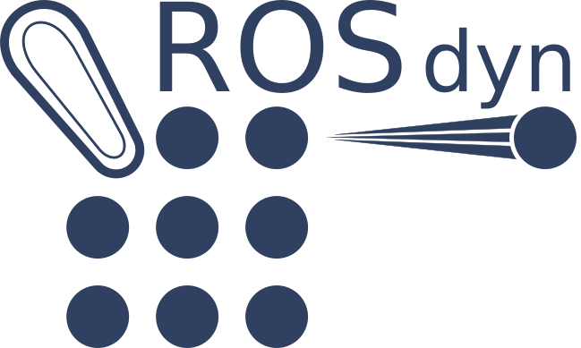
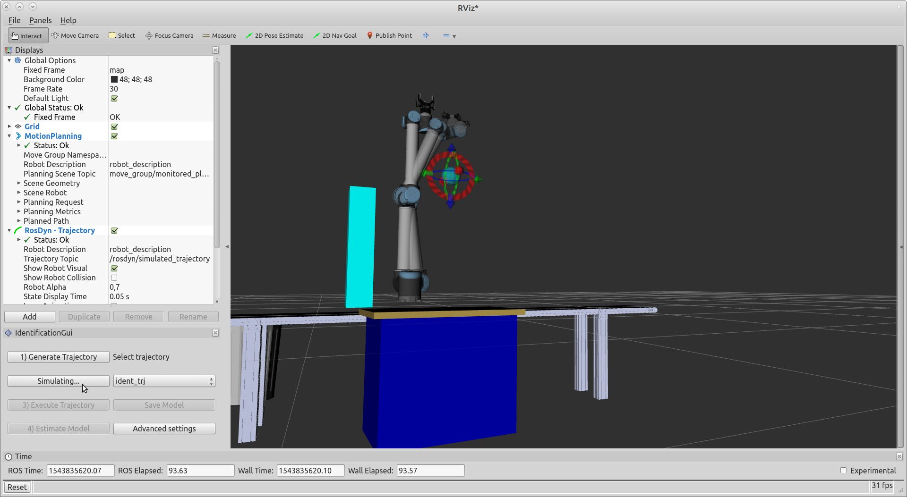

ROSdyn implements a fully automated procedure able to calibrate the robot dynamics model. 

It is integrated with MoveIt! to automatically compute, simulate, and execute identification trajectory. The result is stored in a URDF file.

## Build/Installation 

The software can be installed with the following [rosinstall file](rosdyn.rosinstall). 

Travis CI Kinetic Build: [](https://travis-ci.org/CNR-STIIMA-IRAS/rosdyn)


## List of packages

### **rosdyn_core** [see README](rosdyn_core/README.md):
Dynamics header library based on Eigen. With respect to KDL, it has two advantages: it is faster and it allow computing model regressor. 


An example of usage can be found [here](rosdyn_core/test/rosdyn_speed_test.cpp)

The following list shows the computation times for a 6DOF robot on a laptop Asus PU551J with Ubuntu 16.04 (Release build,  average on 10000 trials).

** computation time in microseconds: **

> pose                                            =  0.75970 [us] 

> pose + jacobian                                       =  1.06562 [us]

> pose + jacobian + velocity twists for all links                   =  1.25589 [us]

> pose + jacobian + velocity twists for all links + linear aceleration twists for all links        =  1.25351 [us]

> pose + jacobian + velocity twists for all links +  non linear acceleration twists for all links    =  1.51663 [us]

> pose + jacobian + velocity twists for all links +  acceleration twists for all links               =  1.83826 [us]

>pose + jacobian + velocity twists for all links +  acceleration twists for all links               + jerk twists for all links                       =  2.68916 [us]

>pose + jacobian + velocity twists for all links +  acceleration twists for all links               + joint torque                                    =  3.76733 [us]

>pose + jacobian +  joint inertia matrix                                  = 10.06761 [us]


### **rosdyn_identification**
Nodelet-based library for trajectory generation and for model calibration.

### **rosdyn_gui**
RViz front-end plugin

### **rosdyn_identification_msgs**
Action definition for generating identification trajectory and estimating model.

## Required parameters

The RosDyn identification package requires the following parameters. Most of them can be changed with the GUI by using the *Advanced settings button*.

```yaml
group_name: "ur10"  # moveit move group name
rescale: false # avoid online rescaling of trajectory
meto_cfg:
  acceleration_scaling: 1.0 # maximum acceleration scaling during test

  speed_scaling: 1.0 # maximum velocity scaling during test

  verbose: true # print additional information on console

  urdf_param: "robot_description" # name of the robot_description parameter

  trajectory_namespace: "ident_trj" # name of the identification trajectory
  
  controller_joint_names:  # list of controlled joint of the move group (the joints which provide effort information, typically the motorized ones)
  - ur10_shoulder_pan_joint
  - ur10_shoulder_lift_joint
  - ur10_elbow_joint
  - ur10_wrist_1_joint
  - ur10_wrist_2_joint
  - ur10_wrist_3_joint

   
  # stage 1
  # trajectory that explore the entire workspace.
  # It should be longer than 30 seconds

  # stage 2:
  # trajectories that perform small movements inside a region to identify friction and grativational part.
  
  opt_cfg:
  
    stage1_duration: 10 # duration of stage 1 trajectory
    
    region_stage2: 0 # number of region in stage 2 trajectory

    point_per_region: 5 # number of point inside a region

    trials: 3 # number of trajectories computed for obtainng the best one
    
  filter:

    frequency: 50 # filter cutting frequency in [Hz]: position, velocity and effort are low-pass filtered. Acceleration is computed by high-pass filtering the velocity.

    sample_period: 0.008 # sampling period of the logged signal


cybersort: # name of the robot inside the robot description

  joint_names: # moveable joints of the chain (both motorized or passive)
  - ur10_shoulder_pan_joint
  - ur10_shoulder_lift_joint
  - ur10_elbow_joint
  - ur10_wrist_1_joint
  - ur10_wrist_2_joint
  - ur10_wrist_3_joint
  - 
  base_link: "ur10_base_link" # first link of the chain 
  tool_link: "ur10_tool0" # last link of the chain
  
  gravity: [0, 0, -9.806] # gravity acceleration
  

  # Joint friction types:
  # Ideal:        0.0
  # Polynomial1:  coloumb*sign(velocity)+viscous*velocity
  # Polynomial2:  coloumb*sign(velocity)+first_order_viscous*velocity+second_order_viscous*sign(velocity)*velocity^2
  #
  # sign(velocity) =  1                      if velocity>min_velocity
  #                  -1                      if velocity<-min_velocity
  #                   velocity/min_velocity  otherwise
  #
  # velocity if saturated betwen  [-max_velocity, max_velocity]
  ur10_shoulder_pan_joint : 
  
    # ur10_shoulder_pan_joint has a Polynomial1 friction, with a term depending on the velocity sign (coloumb) and a term linearly depending on velocity. The sign is approximeted with a straight line with the velocity is less (in modulus) then min_velocity. Velocity is satured if greater than max_velocity.
    
    friction: 
      type: "Polynomial1"
      constants: 
        max_velocity: 10
        min_velocity: 1.0e-6
      coefficients:
        viscous: 0
        coloumb: 0
        
  ur10_shoulder_lift_joint:
  
      # ur10_shoulder_lift_joint has a Polynomial2 friction, with a term depending on the velocity sign (coloumb), a term linearly depending on velocity, and a term depending of the square of the velocity multiplied by the velocity sign. The sign is approximeted with a straight line with the velocity is less (in modulus) then min_velocity. Velocity is satured if greater than max_velocity.
      
    friction:
      type: "Polynomial2"
      constants: 
        max_velocity: 10
        min_velocity: 1.0e-10
      coefficients:
        first_order_viscous: 0
        second_order_viscous: 0
        coloumb: 0
        
  ur10_elbow_joint:
  
  # ur10_elbow_joint has no friction
  
    friction:
      type: "Ideal"
  ur10_wrist_1_joint:
    friction:
      type: "Polynomial1"
      constants: 
        max_velocity: 10
        min_velocity: 1.0e-10
      coefficients:
        viscous: 0
        coloumb: 0
        
  ur10_wrist_2_joint:
    friction:
      type: "Polynomial1"
      constants: 
        max_velocity: 10
        min_velocity: 1.0e-10
      coefficients:
        viscous: 0
        coloumb: 0
        
  ur10_wrist_3_joint:
    friction:
      type: "Polynomial1"
      constants: 
        max_velocity: 10
        min_velocity: 1.0e-10
      coefficients:
        viscous: 0
        coloumb: 0   
        

# logging parameter 
start_log: true # flag to automatically start logging joint_states during trajectory execution.

binary_logger:
  num_worker_threads: 10
  
  # manager_name: name of the nodlet manager (need to be equal to the name in the launch file)
  manager_name: 'binary_logger'

  # Type of the topic that need to be logged (supported JointState, Imu, PoseStamped, WrenchStamped, Float64MultiArray)
  topic_type: 
    - 'JointState'


  JointState:
    # List of the topic to be acquired 
    topic_names:
      - '/ur10/joint_states'  # put the joint_states topic with position, velocity and effort information
      
    # Maximum acquisition time (to be specified for each topic)
    duration:
      - 400 #[s]
  
    # Message decimation (to be specified for each topic)
    decimation:
      - 1 
  
```

## Usage

In order to use RosDyn identification tools, you need to do the following preliminary steps:

> Create a moveit package (see <a href="http://docs.ros.org/kinetic/api/moveit_tutorials/html/doc/setup_assistant/setup_assistant_tutorial.html">tutorial</a>)

> Define the list of parameters in **required parameters** section

> in RViz: 

>> click on *Panels* tag, then *add new panel*, select *IdentificationGui*

>> check on *Add* in the Display widgets, addd a *Trajectory* visualization

>> In the *Trajectory* visualization, select as Trajectory topic */rosdyn/simulated_trajectory*

>> be sure that the MoveIt! scene contains all the obstacles!

Now you are ready to generate a trajectory by clicking of *1) Generate Trajectory*, it will required seconds or minutes depending on the desired trajectory duration

You can visualize the obtained trajectory by clicking on *2) Simulate Trajectory*. With the *Trajectory* visualization you can rerun the simulation or check a spefic part of the trajectory

You can reiterated the trajectory generation if you are not satisfied of the obtained results.

Once you are ready, click on *3) Execute trajectory* to execute the trajectory on real robot. Survey the robotic cell!! Tip: if your robot allows to slow down the trajectory execution, execute the trajectory once with the reduced velocity and once with the normal velocity.

Now you are ready to estimate the model by clicking the *4) Estimate model*, a pop-up window show the model estimation accuracy (TBD).

You can save the model by clicking *Save Model*. A urdf file and a yaml file will be created in /home/$USER/.ros folder.

_NOTE_: *4) Estimate model* uses **all the trajectories** called *ident_trj* inside /home/$USER/.ros folder (or the trajectory namespace you selected). If you do not want to use some trajectory you have to manually remove them.

With the *Advanced settings*, you can change the trajectory generation parameters, as well as the filtering bandwidth and the Friction model.




## Work in progress

ROSdyn is continuously evolving. Not all features are implemented. If find errors or you wish a new feature [please let us know](https://github.com/CNR-STIIMA-IRAS/rosdyn/issues).

## Acknowledgements

RosDyn is developed by CNR-STIIMA (www.stiima.cnr.it)

***
<!--
    ROSIN acknowledgement from the ROSIN press kit
    @ https://github.com/rosin-project/press_kit
-->

<a href="http://rosin-project.eu">
  
</a>

Supported by ROSIN - ROS-Industrial Quality-Assured Robot Software Components.  
More information: <a href="http://rosin-project.eu">rosin-project.eu</a>

  

This project has received funding from the European Union’s Horizon 2020  
research and innovation programme under grant agreement no. 732287.

